# Firestore データモデル

ReCuDe Connectionsを支えるFirestoreのコレクション構造をUML（クラス図）で示す。型定義の一次情報は [`functions/src/models.ts`](../functions/src/models.ts) と [`src/app/core/models/firestore.models.ts`](../src/app/core/models/firestore.models.ts)（内容は複製管理されており常に同期させる）。実装を変更した際はこの図も更新すること。

## 全体構成

```mermaid
classDiagram
    class Tenant {
        <<collection tenants/[tenantId]>>
        +string name
        +string prefecture
        +boolean isActive
        +ProfileField[] profileFields?
        +Timestamp createdAt
    }

    class ProfileField {
        <<embedded array element>>
        +string id (値の保存キー。変えない)
        +string label
        +ProfileFieldType type
        +string[] options? (select)
        +boolean required?
        +boolean searchable?
        +boolean hidden?
        +boolean private? (値を members/[id]/private/profile に置く)
        +ProfileDerivation derive? (type=derived)
    }

    class ProfileFieldType {
        <<enumeration>>
        text
        select
        tags
        yearMonth (YYYY-MM)
        derived (コンバーターで自動計算)
    }

    class ProfileDerivation {
        <<embedded map>>
        +ProfileConverterId converter (例: ageGroup)
        +string source (変換元の項目ID)
    }

    class MemberPrivateProfile {
        <<document members/[memberId]/private/profile>>
        +map values (非公開の項目ID → 値)
        +Timestamp updatedAt
    }

    class TenantBranding {
        <<embedded map>>
        +string siteTitle?
        +string logoUrl?
    }

    class Community {
        <<collection tenants/[tenantId]/communities/[communityId]>>
        +string name
        +string logoUrl?
        +string description?
        +string[] adminIds (ルートの正規の会員。1人以上)
        +number memberCount
        +number rootMemberCount
        +ProfileField[] profileFields? (独自の項目。非公開にできない)
        +MembershipTerms membershipTerms? (参加の条件)
        +boolean requireApproval? (参加に承認が必要)
        +string createdBy
        +Timestamp createdAt
    }

    class CommunityStampPack {
        <<collection tenants/[tenantId]/stampPacks/[packId]>>
        +string name
        +StampPackScope scope (type: root / community, communityId?)
        +boolean hidden
        +map stamps (スタンプID → text, contentType, order, hidden?)
        +string createdBy
        +Timestamp createdAt
    }

    class Member {
        <<collection tenants/[tenantId]/members/[memberId]>>
        +string phoneNumber
        +string displayName
        +string photoPath?
        +map profile? (項目ID → 値。tagsは配列)
        +PositionLevel positionLevel?
        +MembershipStatus membership? (guest / community / member。未設定は会員)
        +string[] communityIds? (所属する連携コミュニティ)
        +string[] adminCommunityIds? (管理者になっている連携コミュニティ)
        +map communityProfiles? (連携コミュニティのID → 独自の項目の値)
        +map communityApplications? (連携コミュニティのID → 参加の申請 status 等)
        +MembershipApplication membershipApplication? (status: pending / approved / rejected, submittedAt, termsAgreement, decidedAt, decidedBy, rejectReason)
        +string invitedVia? (qr / invite)
        +boolean roles.recommender
        +boolean roles.admin?
        +boolean isActive
        +string invitedBy
        +Timestamp createdAt
    }

    class TenantAdmin {
        <<collection tenants/[tenantId]/admins/[adminUid] 廃止>>
        +string email
        +string displayName
        +Timestamp createdAt
    }

    class Invite {
        <<collection tenants/[tenantId]/invites/[inviteId]>>
        +string phoneNumber
        +string recommenderId
        +InviteTarget target? (type: root / community, communityId?)
        +InviteStatus status
        +string resultingMemberId?
        +Timestamp createdAt
        +Timestamp submittedAt?
        +Timestamp decidedAt?
    }

    class CandidateProfileInput {
        <<embedded map>>
        +string displayName
        +map profile (項目ID → 値)
    }

    class ProfileOptionValue {
        <<collection tenants/[tenantId]/profileOptions/[category]/values/[valueId]>>
        +string label
        +Timestamp createdAt
    }

    class Connection {
        <<collection tenants/[tenantId]/connections/[connectionId]>>
        +string[] memberIds
        +string requestedBy
        +ConnectionStatus status
        +Timestamp createdAt
        +Timestamp respondedAt?
    }

    class Room {
        <<collection tenants/[tenantId]/rooms/[roomId]>>
        +RoomType type
        +string[] memberIds
        +number memberCount
        +string name? (group)
        +string description? (group)
        +string connectionId? (direct)
        +Timestamp createdAt
        +Timestamp lastMessageAt?
    }

    class RoomMember {
        <<collection tenants/[tenantId]/rooms/[roomId]/members/[memberId]>>
        +RoomRole role (admin=グループ管理者 / member)
        +Timestamp joinedAt
        +string invitedBy
    }

    class RoomInvitation {
        <<collection tenants/[tenantId]/rooms/[roomId]/invitations/[inviteeId]>>
        +string inviteeId
        +string invitedBy
        +RoomInvitationStatus status
        +Timestamp createdAt
        +Timestamp respondedAt?
    }

    class RoomMessage {
        <<collection tenants/[tenantId]/rooms/[roomId]/messages/[messageId]>>
        +string senderId
        +RoomMessageType type (text / stamp / image)
        +string text?
        +StampRef stamp? (packId, stampId。文字列は旧絵文字スタンプ)
        +MessageMedia media? (path, thumbPath, contentType, width, height, size)
        +map reactions? (会員ID → 絵文字)
        +RoomMessageStatus status
        +Timestamp createdAt
        +boolean threadsUpdated?
    }

    class Thread {
        <<collection tenants/[tenantId]/members/[memberId]/threads/[roomId]>>
        +RoomType roomType
        +string title
        +string otherMemberId? (direct)
        +string lastMessageText
        +string lastSenderId
        +Timestamp lastMessageAt
        +Timestamp lastActivityAt
        +number unreadCount
        +Timestamp lastReadAt
    }

    class GroupInvitationNotice {
        <<collection tenants/[tenantId]/members/[memberId]/groupInvitations/[roomId]>>
        +string roomName
        +string invitedBy
        +string invitedByName
        +Timestamp createdAt
    }

    class PhoneIndexEntry {
        <<collection phoneIndex/[phoneNumber]>>
        +string tenantId
        +string memberId
    }

    class InviteIndexEntry {
        <<collection inviteIndex/[phoneNumber]>>
        +string tenantId
        +string inviteId
    }

    class PasskeyCredential {
        <<collection .../passkeyCredentials/[credentialId]>>
        +string publicKey
        +number counter
        +string[] transports?
        +string deviceLabel
        +boolean backedUp
        +Timestamp createdAt
        +Timestamp lastUsedAt?
    }

    class PasskeyIndexEntry {
        <<collection passkeyIndex/[credentialId]>>
        +string tenantId
        +string kind
        +string uid
        +string memberId?
    }

    class WebauthnChallenge {
        <<collection webauthnChallenges/[requestId]>>
        +string type
        +string challenge
        +string uid?
        +Timestamp createdAt
        +Timestamp expiresAt
    }

    class PinDevice {
        <<collection .../pinDevices/[deviceId]>>
        +string pinHash
        +string deviceLabel
        +number failedAttempts
        +Timestamp lockedUntil?
        +Timestamp createdAt
        +Timestamp lastUsedAt?
    }

    class PinDeviceIndexEntry {
        <<collection pinDeviceIndex/[deviceId]>>
        +string tenantId
        +string kind
        +string uid
        +string memberId?
    }

    class PositionLevel {
        <<enumeration>>
        会長
        幹部
        一般会員
    }


    class InviteStatus {
        <<enumeration>>
        invited
        submitted
        approved
        rejected
    }

    class ConnectionStatus {
        <<enumeration>>
        pending
        accepted
        declined
    }

    class RoomType {
        <<enumeration>>
        direct
        group
    }

    class RoomInvitationStatus {
        <<enumeration>>
        pending
        accepted
        declined
        canceled
    }


    Tenant "1" *-- "0..1" TenantBranding : branding (embedded)
    Tenant "1" *-- "0..30" ProfileField : profileFields (embedded)
    ProfileField ..> ProfileFieldType
    ProfileField *-- "0..1" ProfileDerivation : derive (embedded)
    Member "1" *-- "0..1" MemberPrivateProfile : private/profile
    ProfileOptionValue "0..*" --> "1" ProfileField : category = ProfileField.id
    Tenant "1" *-- "0..*" Member : subcollection
    Tenant "1" *-- "0..50" Community : subcollection
    Tenant "1" *-- "0..100" CommunityStampPack : subcollection
    CommunityStampPack "0..*" --> "0..1" Community : scope.communityId
    Member "0..*" --> "0..*" Community : communityIds
    Community "0..*" --> "1..*" Member : adminIds
    Invite "0..*" --> "0..1" Community : target.communityId
    Tenant "1" *-- "0..*" TenantAdmin : subcollection
    Tenant "1" *-- "0..*" Invite : subcollection
    Tenant "1" *-- "0..*" Connection : subcollection
    Tenant "1" *-- "0..*" Room : subcollection
    Room "1" *-- "1..50" RoomMember : subcollection
    Room "1" *-- "0..*" RoomInvitation : subcollection (groupのみ)
    Room "1" *-- "0..*" RoomMessage : subcollection
    Member "1" *-- "0..*" Thread : subcollection
    Member "1" *-- "0..*" GroupInvitationNotice : subcollection
    Tenant "1" *-- "0..*" ProfileOptionValue : subcollection (category別)
    Member "1" *-- "0..*" PasskeyCredential : subcollection
    TenantAdmin "1" *-- "0..*" PasskeyCredential : subcollection
    Member "1" *-- "0..*" PinDevice : subcollection
    TenantAdmin "1" *-- "0..*" PinDevice : subcollection

    Invite "1" *-- "0..1" CandidateProfileInput : candidateProfile (embedded)
    Invite "0..*" --> "1" Member : recommenderId
    Invite "0..1" --> "0..1" Member : resultingMemberId
    Invite ..> InviteStatus
    Invite ..> CandidateProfileInput

    Connection "0..*" --> "2" Member : memberIds
    Connection "0..*" --> "1" Member : requestedBy
    Connection ..> ConnectionStatus
    Connection "0..1" --> "0..1" Room : roomId = connectionId (direct)
    Room ..> RoomType
    RoomInvitation ..> RoomInvitationStatus
    RoomInvitation "0..*" --> "1" Member : inviteeId / invitedBy
    RoomMessage "0..*" --> "1" Member : senderId
    Thread "1" --> "1" Room : roomId (ドキュメントID一致)

    Member ..> PositionLevel

    PhoneIndexEntry "1" --> "1" Tenant : tenantId
    PhoneIndexEntry "1" --> "1" Member : memberId
    InviteIndexEntry "1" --> "1" Tenant : tenantId
    InviteIndexEntry "1" --> "1" Invite : inviteId
    PasskeyIndexEntry "1" --> "1" Tenant : tenantId
    PasskeyIndexEntry "0..1" --> "0..1" Member : memberId (kind=member)
    PasskeyIndexEntry "1" --> "1" PasskeyCredential : credentialId (ドキュメントID一致)
    PinDeviceIndexEntry "1" --> "1" Tenant : tenantId
    PinDeviceIndexEntry "0..1" --> "0..1" Member : memberId (kind=member)
    PinDeviceIndexEntry "1" --> "1" PinDevice : deviceId (ドキュメントID一致)
```

## コレクション一覧

| パス | 用途 |
|---|---|
| `tenants/[tenantId]` | テナント（県人会などの組織）基本情報、ブランディング設定、プロフィール項目（`profileFields`: 項目ID・項目名・入力方法・選択肢・必須・検索に使うか・非表示・非公開・自動計算の設定。並び順どおり）。プロフィール項目は管理者が `updateProfileFields` で設定する。自動計算（`type: 'derived'`）の値は、コンバーター（`functions/src/profileConverters.ts`）が変換元の項目から計算して `profile` に保存する（保存時・項目の設定変更時・毎月1日 0:05 JST の `recomputeDerivedProfiles`） |
| `tenants/[tenantId]/members/[memberId]` | 会員（ゲストを含む）。`membership: 'guest'` はゲスト（招待されて参加し、まだ正規の会員でない人）、`'community'` は連携コミュニティへの招待で参加した、連携コミュニティだけのメンバー（ルートの中ではゲストと同じ制限。カスタムクレーム `isGuest` も true）、`communityIds` は所属する連携コミュニティ（カスタムクレーム `communityIds` にも入れる）、`adminCommunityIds` は管理者になっている連携コミュニティ、`communityProfiles` は連携コミュニティ独自の項目の値（本人が `updateCommunityProfile` で保存）、`communityApplications` は承認が必要な連携コミュニティへの参加の申請（`decideCommunityApplication` で審査）、未設定は正規の会員。ゲストは `membershipApplication` で正規の会員を申請し、管理者が `decideMembership` で審査する。カスタムクレーム `isGuest` でも区別する。`displayName`（名前）と `photoPath`（プロフィール画像）は固定項目、テナントの項目の値は `profile`（項目ID → 値。複数入力は配列）。本人の更新は `updateMyProfile` 経由。`roles.recommender`が認定推薦者フラグ、`roles.admin`が管理者フラグ（管理者＝会員＋管理者ロール。テナントに最低1人は必要）。`isActive: false`はアカウント停止 |
| `tenants/[tenantId]/admins/[adminUid]` | **廃止**。旧方式の事務局アカウント（メール＋パスワード）。管理者ロール方式へ移行したため新規作成しない。ルールで読み書きとも禁止 |
| `tenants/[tenantId]/communities/[communityId]` | 連携コミュニティ（SPEC 9章。例: 在京高校同窓会）。名称・ロゴ・説明・管理者（`adminIds`: ルートの正規の会員1人以上）・参加者数（`memberCount`、うちルートの会員でもある人 `rootMemberCount`。有効な会員のみ）。同じテナントの会員は読める。独自のプロフィール項目 `profileFields`、参加の条件 `membershipTerms`、参加に承認が必要か `requireApproval` も持つ。書き込みは Cloud Functions（`createCommunity`・`updateCommunity`・`deleteCommunity`・`updateProfileFields`・`updateMembershipTerms`（どちらも `scope` で対象を指定）・`setCommunityAdmin`）だけ。管理者は会員データの `adminCommunityIds`（カスタムクレームにも入れる）と揃える。ロゴは Storage の `tenants/[tenantId]/communities/[communityId]/logo` |
| `tenants/[tenantId]/stampPacks/[packId]` | コミュニティのスタンプのパック（管理 A2。packId は `tp-` で始まる）。名前、使える範囲 `scope`（`{type: 'root'}` はルートの正規の会員、`{type: 'community', communityId}` はその連携コミュニティのメンバー）、公開状態 `hidden`、スタンプ `stamps`（スタンプID → 文言・形式・並び順・非表示）。同じテナントの会員は読める。書き込みは Cloud Functions（`createStampPack`・`addCommunityStamp`・`updateStampPack`）だけ。送れるかどうかはメッセージのルールで確かめる。画像は Storage の `tenants/[tenantId]/stampPacks/[packId]/[stampId]`（公開読み取り・上書きしない） |
| `tenants/[tenantId]/invites/[inviteId]` | 招待の記録。招待先 `target`（`{type: 'community', communityId}`。未設定はルートコミュニティ）。「招待の送付」（名前、電話番号かメールアドレス、`status`: invited→joined）と、QRコードで参加した人（`via: 'qr'`）。`recommenderId` は招待した会員（名前は旧仕様のまま）。submitted・approved・rejected はゲストの仕組みを入れる前の招待の状態 |
| `tenants/[tenantId]/profileOptions/[category]/values/[valueId]` | 自由入力・複数入力の項目の入力候補（`category` はプロフィール項目のID）。会員・候補者の入力で自動的に増える |
| `tenants/[tenantId]/connections/[connectionId]` | 会員間のコネクト申請〜つながり成立の記録。検索や信頼ポイントに使う関係の記録で、トークのルームとは別に持つ |
| `tenants/[tenantId]/connections/[connectionId]/messages/[messageId]` | **読み取り専用（移行済み）**。旧方式の1対1チャット。`functions/scripts/migrate-rooms.ts` でルームへコピーした。新規作成はルールで禁止 |
| `tenants/[tenantId]/rooms/[roomId]` | トークのルーム（1対1＝`direct`・グループ＝`group`）。`memberIds`でメンバーだけが読める |
| `tenants/[tenantId]/rooms/[roomId]/members/[memberId]` | ルームのメンバー。役割（`admin`＝グループ管理者／`member`）と、誰の招待で参加したか（`invitedBy`）。グループ管理者は複数人でき、常に1人以上いる（テナントの管理者 `roles.admin` とは別物） |
| `tenants/[tenantId]/rooms/[roomId]/invitations/[inviteeId]` | グループへの招待（招待される会員ごとに1件） |
| `tenants/[tenantId]/rooms/[roomId]/messages/[messageId]` | メッセージ（テキスト・スタンプ・画像）。クライアントから直接作成する（ルールで送信者本人・メンバー・項目を検証）。リアクション（`reactions`）は、メンバーが自分の分だけ付け外しできる |
| `tenants/[tenantId]/members/[memberId]/private/profile` | 非公開のプロフィール項目（`private: true`。例: 生年月 `YYYY-MM`）の値。本人と管理者だけが読める。書き込みは Cloud Functions のみ（`updateMyProfile`・`applyForMembership`・`decideMembership`） |
| `tenants/[tenantId]/members/[memberId]/threads/[roomId]` | 会員ごとのトーク一覧（最新メッセージ・未読数）。メッセージ作成時に `onRoomMessageCreated` が全メンバー分を更新する。本人は既読にする更新だけできる |
| `tenants/[tenantId]/members/[memberId]/stamps/[stampId]` | マイスタンプ（名前・画像の形式）。本人だけが読み書きできる。画像は Storage の同じ名前のパス |
| `tenants/[tenantId]/members/[memberId]/groupInvitations/[roomId]` | 自分に届いているグループ招待（トーク一覧に出す）。Cloud Functionsのみが書き込む |
| `tenants/[tenantId]/members/[memberId]/passkeyCredentials/[credentialId]` | 会員が登録したパスキー(WebAuthn Credential) |
| `tenants/[tenantId]/admins/[adminUid]/passkeyCredentials/[credentialId]` | **廃止**。旧方式の事務局アカウントが登録したパスキー（ログインには使えない） |
| `tenants/[tenantId]/members/[memberId]/pinDevices/[deviceId]` | 会員が登録したPINログイン用端末 |
| `tenants/[tenantId]/admins/[adminUid]/pinDevices/[deviceId]` | **廃止**。旧方式の事務局アカウントが登録したPINログイン用端末（ログインには使えない） |
| `phoneIndex/[phoneNumber]` | 電話番号→(テナント, 会員)の逆引き。ログイン時の`resolveMemberSession`が参照 |
| `inviteCodes/[code]` | 招待リンク（`/join?code=…`）のコード → (テナント, 招待した会員, 種類 qr/invite, 招待ID, 有効か)。連携コミュニティへの招待は `communityId` を持つ。QRコードは会員・招待先ごとに1つで作り直すまで有効、招待の送付は1回だけ有効。Cloud Functions 専用（ルールで読み書きとも禁止） |
| `inviteIndex/[phoneNumber]` | 電話番号→(テナント, 招待)の逆引き。候補者登録時の`getInviteStatus`/`submitCandidateProfile`が参照 |
| `passkeyIndex/[credentialId]` | credentialId→(テナント, 種別, uid, 会員ID)の逆引き。usernameless認証時に`completePasskeyAuthentication`が参照 |
| `pinDeviceIndex/[deviceId]` | deviceId→(テナント, 種別, uid, 会員ID)の逆引き。PINログイン時に`pinSignIn`が参照 |
| `webauthnChallenges/[requestId]` | パスキー登録/認証の一時チャレンジ。完了系Functionが検証後に削除する使い捨てドキュメント |

## ドキュメントIDの設計ルール

- **`connections/[connectionId]`**: `[memberIdA, memberIdB].sort().join('_')`。2者間で常に1つのドキュメントに定まり、重複申請の判定に使う。
- **`rooms/[roomId]`**: 1対1（`direct`）はConnectionのIDと同じ値。グループは自動生成ID。
- **`rooms/[roomId]/invitations/[inviteeId]`**・**`members/[memberId]/threads/[roomId]`**・**`members/[memberId]/groupInvitations/[roomId]`**: 相手の会員ID・ルームIDをそのままドキュメントIDにし、1人につき1件に定める。
- **`phoneIndex/[phoneNumber]`** / **`inviteIndex/[phoneNumber]`**: E.164形式の電話番号そのもの（例: `+819012345678`）。
- その他のコレクションはFirestoreの自動生成IDを使用。`pinDevices`/`pinDeviceIndex`の`deviceId`は`credentialId`と異なり、PINと組み合わさって初めて認証情報として機能する準機密値として扱う（ログ出力・エラーメッセージ・UI表示に含めない）。

## セキュリティモデルとの関係

Firestoreセキュリティルール（[`firestore.rules`](../firestore.rules)）は、Firebase Authのカスタムクレーム（`tenantId`, `memberId`, `isRecommender`, `isAdmin`, `isGuest`）を使ってテナント単位のアクセス制御を行う。書き込みは原則すべてCloud Functions（Admin SDK）経由に統一し、クライアントからの直接書き込みは許可していない（読み取りのみ一部を許可）。カスタムクレームは会員ドキュメントの`roles`から作られ（`functions/src/memberClaims.ts`）、`resolveMemberSession`（電話番号ログイン時）、`completePasskeyAuthentication`・`pinSignIn`（パスキー・PINログイン時）、管理者がロールや状態を変更したとき（`setMemberRoles`・`setMemberStatus`）、ゲストとして参加したとき（`joinAsGuest`）、会員申請が承認されたとき（`decideMembership`）に設定し直される。アカウント停止時はリフレッシュトークンも無効にする（発行済みのIDトークンは最長1時間有効）。

管理者向けのCloud Functionsは、`isAdmin`クレームに加えて会員ドキュメントの`roles.admin`・`isActive`も確認する（`requireAdmin`）。最後の1人の有効な管理者から管理者ロールを外すこと・停止すること、自分自身を停止することはサーバー側で拒否する。旧方式の事務局アカウント（`role: 'admin'`クレーム）は、ルール・Cloud Functionsのどちらでも権限を持たない。

`passkeyCredentials`・`passkeyIndex`・`webauthnChallenges`は`phoneIndex`/`inviteIndex`と同様にクライアントからの直接読み書きを全面禁止しており、一覧取得・登録・削除はすべて専用のCloud Functions（`listPasskeyCredentials`/`startPasskeyRegistration`/`completePasskeyRegistration`/`deletePasskeyCredential`）経由で行う。

`pinDevices`・`pinDeviceIndex`も同様に全面禁止で、`listPinDevices`/`setupPin`/`pinSignIn`/`removePinDevice`経由のみ。PINは低エントロピーな値のため、`setupPin`でセットアップした特定の端末（`deviceId`をlocalStorageに保持）からしかログインできない設計にし、`pinSignIn`側で試行回数制限（5回失敗で15分ロックアウト）を設けている。

## Firestore外のストレージ

ロゴ画像（`Tenant.branding.logoUrl`が指すファイル）はFirestoreではなくFirebase Storageの`tenants/[tenantId]/branding/logo`に保存される（[`storage.rules`](../storage.rules)参照）。

トークの画像は Storage の `tenants/[tenantId]/rooms/[roomId]/media/[messageId]/original.jpg`（長辺2048pxのJPEG）と `thumb.jpg`（長辺480px）に保存する。端末で縮小・再エンコード（EXIFの削除）してから上げる。読み書きできるのはルームのメンバーだけで、上書きはできない（Storageのルールから Firestore のルームの `memberIds` を参照する）。グループが削除されると、画像もまとめて削除される。

プロフィール画像は Storage の `tenants/[tenantId]/members/[memberId]/photo/[時刻].jpg`（256×256のJPEG、1MBまで）。同じテナントの会員なら誰でも読め、上げる・消すのは本人だけ。差し替えるたびに別の名前で上げ、会員ドキュメントへの反映と古い画像の削除は `updateMyProfile` が行う。

スタンプの画像は Storage ではなく、アプリと一緒に配信する静的ファイル（`public/stamps/`）。メッセージにはスタンプのID（`packId`・`stampId`）だけを保存する。

マイスタンプの画像は Storage の `tenants/[tenantId]/members/[memberId]/stamps/[stampId]`（320×320の透過WebPまたはPNG、512KBまで）。メッセージの中で表示するため同じテナントの会員なら誰でも読めるが、上げる・消すのは本人だけ。メッセージには `packId: 'custom'` と `ownerId`（登録した会員）を保存し、送れるのは本人だけ（Firestoreのルールでスタンプの存在も確認する）。
